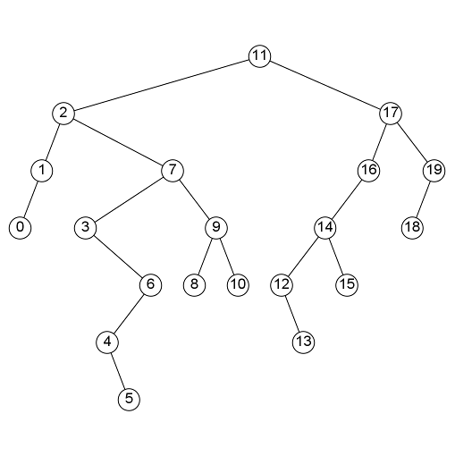

# 《算法（第4版）》课后练习 

这个仓库记录了[《算法（第4版）》](https://book.douban.com/subject/19952400/)这本书中的课后练习答案，所有练习使用`Kotlin`编写，因为`Kotlin`比`Java`更简洁，而且完全兼容`Java`，可以使用官方提供的开发包，隐藏、简化无意义的重复代码（例如读写文件、读取键盘输入、使用绘图API），只关注算法核心逻辑。项目中大量使用了`Kotlin`的语言特性及标准库，比如高阶函数，对不熟悉`Kotlin`的人可能会造成一些困惑，但是用起来真的很方便，实在不想写太多的重复代码。

项目使用`Intellij IDEA`作为`IDE`，可以在[这里下载社区免费版](https://www.jetbrains.com/idea/download/)。运行程序后，点击`File->Open`选择项目目录，打开后即可查看、运行项目。每个练习都有一个`main`方法，点击`main`方法左侧的绿色箭头即可运行、调试程序。

由于官方给的测试数据太大，且只有部分算法需要测试数据，所以仓库中不包含测试数据，需要自己从[官网下载](https://algs4.cs.princeton.edu/code/algs4-data.zip)测试数据并放到`data`或`algs4-data`目录中（已配置`.gitignore`）

学习过程中主要参考了以下两个仓库，每节做完后会和他们的实现方式对比、优化：

> [algorithms-sedgewick-wayne](https://github.com/reneargento/algorithms-sedgewick-wayne)
>
> [Algorithms-4th-Edition-in-Csharp](https://github.com/ikesnowy/Algorithms-4th-Edition-in-Csharp)

第一个仓库是最完整的仓库，所有练习都有答案；第二个仓库是`C#`版本的，只完成到第三章，但是质量非常高，每题都有详细说明，还配有相应的[搜题网站](https://alg4.ikesnowy.com/)，前三章我会优先参考第二个仓库的答案。

本仓库暂时只完成到第五章，大部分的题目都有解答，缺失了一些比较简单的问答题、少部分的实验题以及所有的证明题 :sweat:

**相比其他仓库的优点：**

* 尽量少的重复代码：通过灵活的封装，配合`Kotlin`的扩展函数和高阶函数，让代码更简洁（需要配合`IDE`使用）
* 每题都附带了题目原文（第一章待后续补充），大部分题目都带有解题思路，先有伪代码，逻辑完整后再通过代码实现
* 每题都有测试代码，尽量充分的测试，对于一些比较适合用图形展示的数据结构或算法，配备了相应的绘图程序，例如各种排序算法、二叉查找树、红黑树、无向图的最小生成树、A*寻路算法等

### 附录：部分算法的图形展示

[希尔排序](./src/chapter2/section1/ShellSort.kt)：
数组大小：20  延迟：500 ms  数组初始状态：0-随机数组（1-升序 2-降序 3-接近升序 4-接近降序 5-大量重复元素）。
深灰色表示比较大小，黑色表示交换元素。

[自顶向下的归并排序](./src/chapter2/section2/TopDownMergeSort.kt)：
数组大小：32  延迟：500 ms  数组初始状态：0-随机数组
上半部分为原始数组，下半部分为相同大小的辅助数组，从原始数组向辅助数组中复制数据时，对应区间变为深灰色，黑色表示从辅助数组中向原始数组中复制元素。

[随机生成的二叉查找树](./src/chapter3/section2/BSTGraphics.kt)：

[红黑树添加、删除操作](./src/chapter3/section3/ShowChangeProcessRedBlackBST.kt)：

[无向图最小生成树的Kruskal算法](./src/chapter4/section3/KruskalMST.kt)：

[A\*寻路算法](./src/chapter2/section5/ex32_AStartPathFind.kt)：

