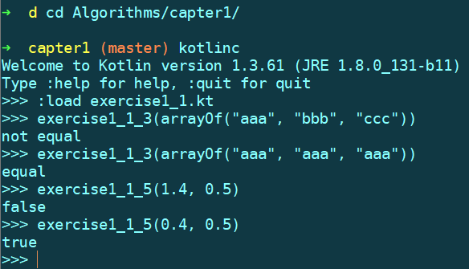

# 《算法（第4版）》课后练习 

**申明：所有代码未经过严谨的测试，也未参考过标准答案，不保证Bug Free，自测通过，而且对部分练习进行了微调或扩展，仅供参考。**

使用`kotlin`语言编写，因为我是一位`Android`开发，擅长`java`和`kotlin`，其他语言也会一些，但是不熟练，所以就在这两门语言中选一种。又因为`java`语法太啰嗦，无论是写还是测试都很麻烦，`kotlin`自带的交互式命令行工具让编译和测试都非常方便，我常用的测试方法如下：

1、需要先配置好`kotlin`编译环境，并将`kotlin`命令加入环境变量中

2、我在`windows`上使用`git bash`作为命令行工具，而不使用`windows`自带的命令提示符工具

下面是测试练习1.1.3和1.1.5的示例

先切换到要测试的文件目录下，使用`kotlinc`命令就可以进入交互式命令行工具，如果没有将`kotlinc`加入环境变量中，需要输入完整路径，使用`:load <filename>`命令可以将`.kt`文件加载到运行环境中，类似于`js`或`python`等脚本语言，省去了编译命令，非常方便，当然，如果文件中有语法错误也会导致编译失败，提示相应错误信息，然后就可以直接调用定义的顶层函数了，使用不同的参数多次调用，可以很方便的测试各种边界条件。